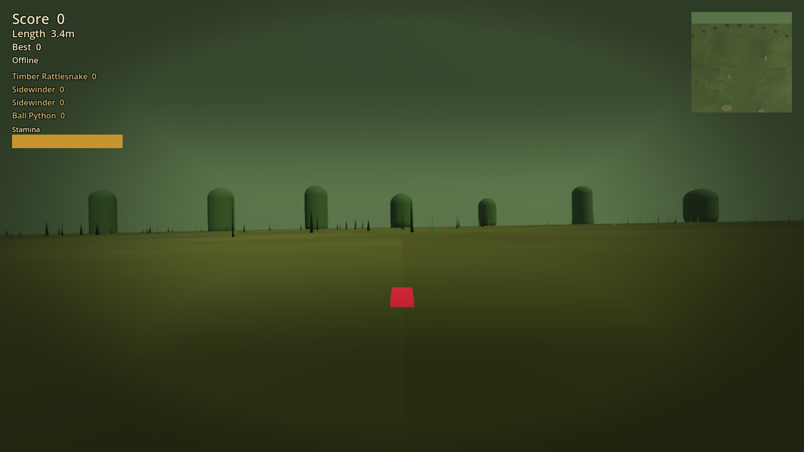
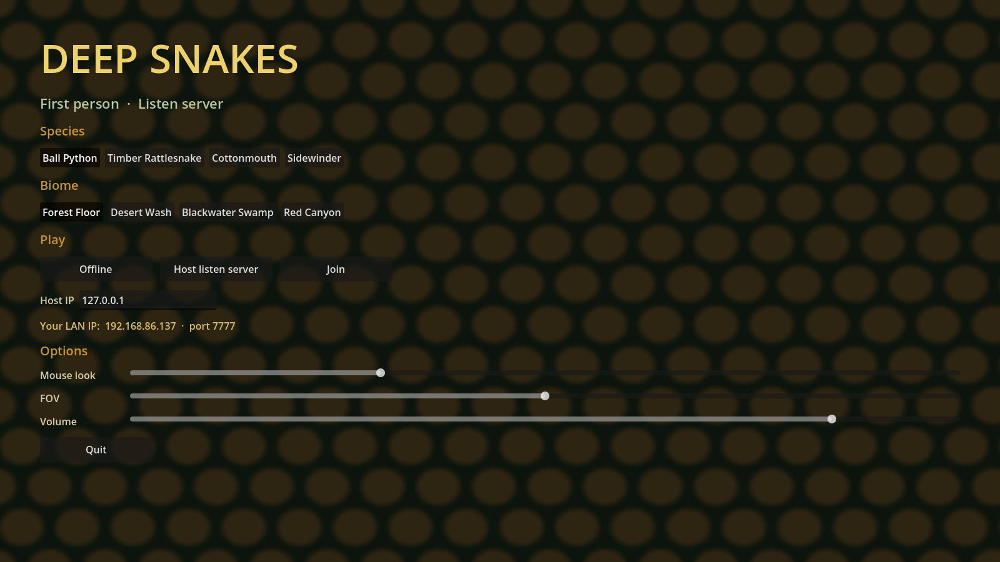
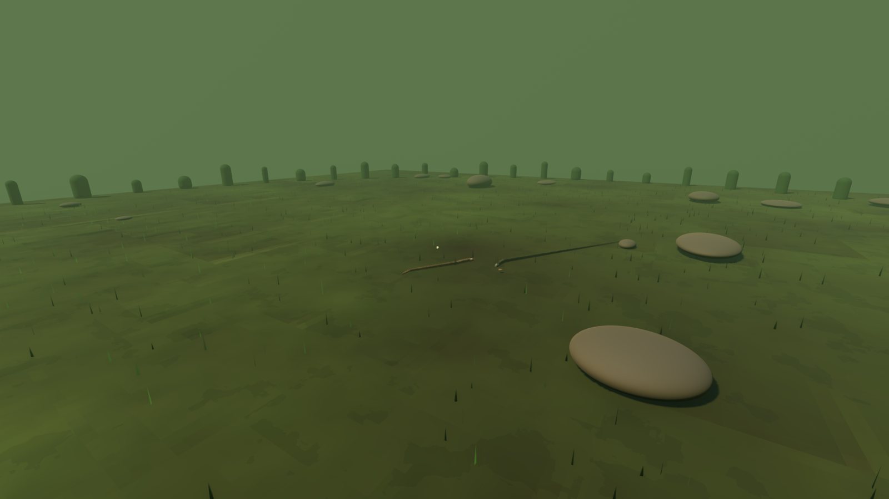
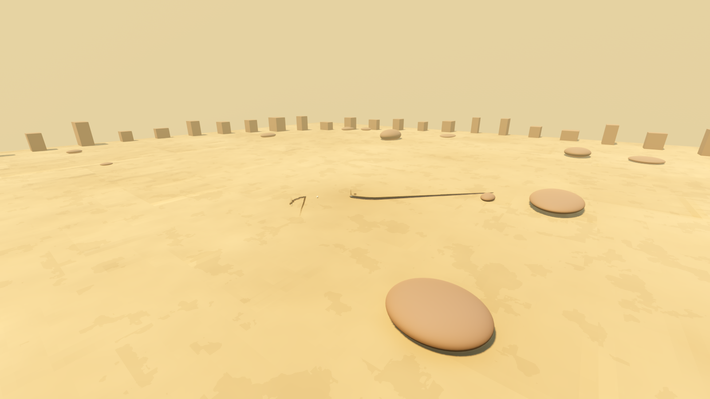
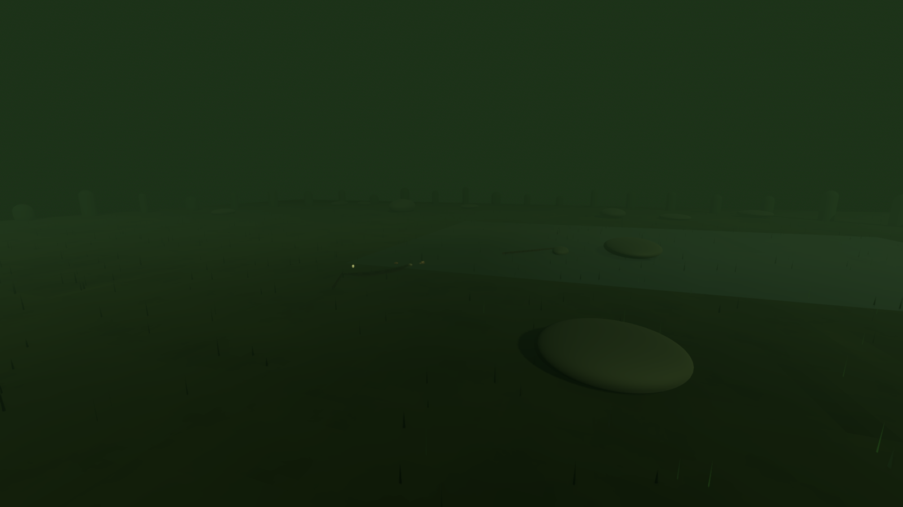
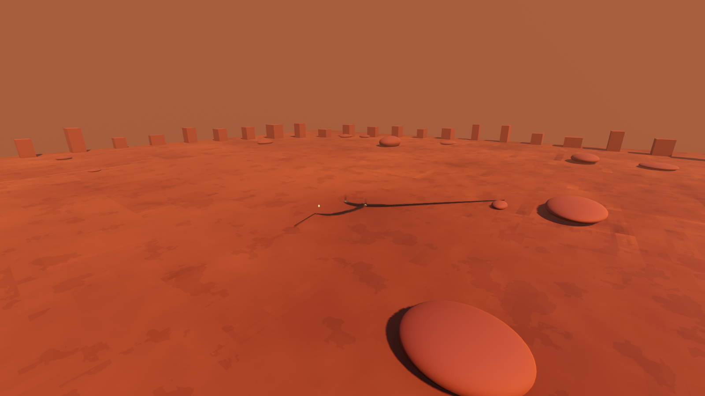
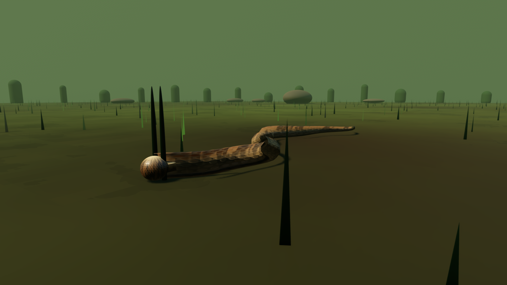
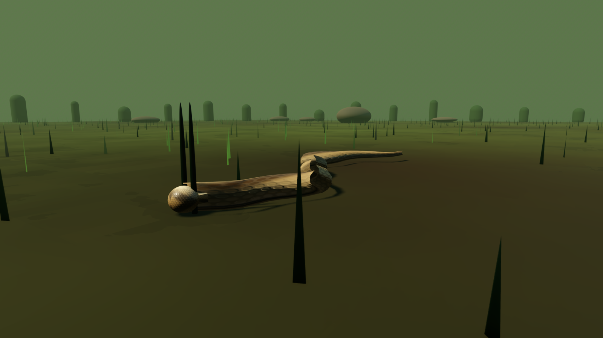
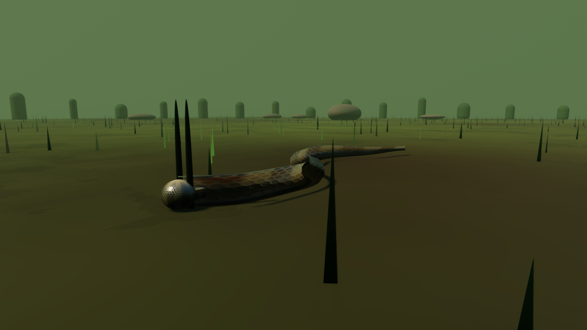
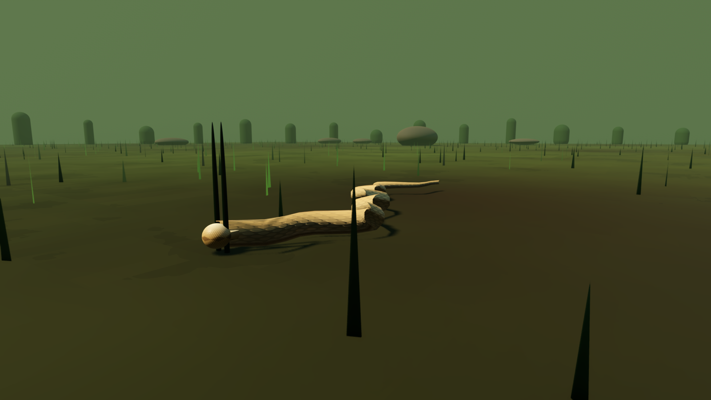

# DeepSnakes 3D

First-person snake in Godot 4.7. You are the snake: mouse steers, the body trails behind you as a live scaled tube, eat prey to grow, do not hit yourself. Offline or a **listen server** (you host and play; friends join on the LAN).



## Trailer

Two-minute action gameplay with spoken voiceover, recorded from the live renderer:

[](docs/trailer/deepsnakes-trailer.mp4)

[Watch the MP4](docs/trailer/deepsnakes-trailer.mp4) · also attached on the [v0.1.0 release](https://github.com/JerkyJesse/deepsnakes-3d/releases/tag/v0.1.0).

## Windows build

Private repo. Grab `DeepSnakes3D-windows.zip` from the [v0.1.1 release](https://github.com/JerkyJesse/deepsnakes-3d/releases/tag/v0.1.1), unzip, run `DeepSnakes3D.exe`.

Local rebuild (Godot **4.7.2** standard editor, Windows export templates already installed):

```powershell
powershell -ExecutionPolicy Bypass -File tools/export_windows.ps1
```

Output: `export/windows/DeepSnakes3D.exe` (gitignored).

## Gallery

### Menu



### Biomes

| Forest Floor | Desert Wash |
| --- | --- |
|  |  |

| Blackwater Swamp | Red Canyon |
| --- | --- |
|  |  |

### Species

| Ball Python | Timber Rattlesnake |
| --- | --- |
|  |  |

| Cottonmouth | Sidewinder |
| --- | --- |
|  |  |

## Play from the editor

1. Open this folder as a project in [Godot 4.7.2](https://godotengine.org/download/windows/) (GDScript, not the .NET build).
2. Press **F5**.
3. Pick a species and biome.
4. **Offline** — local game with AI snakes.
5. **Host listen server** — you play on the host (port **7777**). Allow the port through the firewall if others cannot connect.
6. **Join** — enter the host, then Join.

### Controls

| Action | Key |
| --- | --- |
| Steer | Mouse |
| Boost | W or Shift |
| Slow | S |
| Extra turn | A / D |
| Strike | Space |
| Pause | Esc (Q from pause returns to menu) |

## Rules

- Eat rodents, frogs, or eggs to grow and score.
- Hitting your own body (after a neck grace) kills you.
- Hitting another snake: the longer snake wins; the shorter one dies. Winner gains length and points.
- Death respawns after a few seconds. High score is saved locally.
- Stamina (boost with W) and a top-down minimap are on the HUD.

## Optional photogrammetry ground

Drop CC0 PBR maps into:

`assets/photogrammetry/<biome>/diff.jpg`  
`assets/photogrammetry/<biome>/nor.jpg`  
`assets/photogrammetry/<biome>/rough.jpg`

Biome ids: `forest`, `desert`, `swamp`, `canyon`. If those files are missing, the ground shader is used instead.

A scanned snake mesh is not required. Skin is a scale shader. See `assets/models/snakes/README.md` if you later want to drop a glTF scan.

## Repo

This project is a **private GitHub** repository. Cursor Origin (`origin.cursor.com`) is not set up here: the Origin CLI does not run on native Windows, and this machine has no WSL distro.

Re-record the trailer with voiceover (Godot Movie Maker, edge-tts, ffmpeg):

```powershell
powershell -ExecutionPolicy Bypass -File tools/record_trailer.ps1
```
